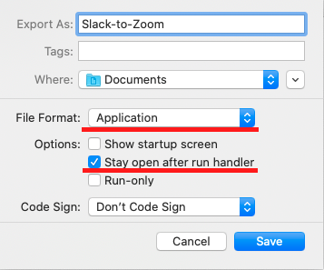

# Zoom meetings to Slack status sync script

Provided Apple Script is useful for changing your Slack status and/or DnD mode while in Zoom meetings.

### How to use it

1. Clone repository or simply download the `zoom-to-slack-status-sync.applescript` file
2. Open it with Script Editor on your Mac
3. Change the value of the `slack_token` variable to your token
4. You may want to change `status_text` and `status_emoji` variables to customise your custom status emoji and message
5. Run the script (you will need to grant *Accessibility* permission to Script Editor)

### How to compile an app and run it when system starts

5. In Script Editor select *File* - *Export* menu
6. In Export dialog select *Application* as *File Format* and check *Stay open after run handler* checkbox
   
7. Save application to desired location
8. Open *System Preferences* - *Users and Groups* and switch to *Login Items* tab
9. Click on + button and choose previousy exported application
10. Grant *Accessibility* permission to the exported application on *Privacy* tab in *System Preferences* - *Security and Privacy*

### Generating Slack token

* Go to https://api.slack.com/apps and authorize.

* Click on *Create New App* button, choose the name for your app and development workspace

* In the *Add features and functionality* block click on *Permissions* button

* Then in the *Scopes* block click *Add an OAuth Scope* button in **User Token Scopes**
  You will need following scopes enabled on your Slack token:
  * [`users.profile:write`](https://api.slack.com/scopes/users.profile:write)
  * [`dnd:write`](https://api.slack.com/scopes/dnd:write)

* After that install your app to your Slack workspace (you may need approval from org admins in some cases)

* After app installation you will get your Slack token

